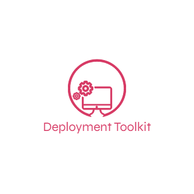
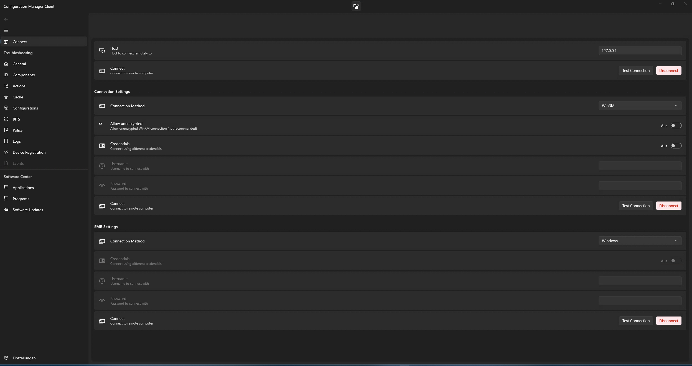
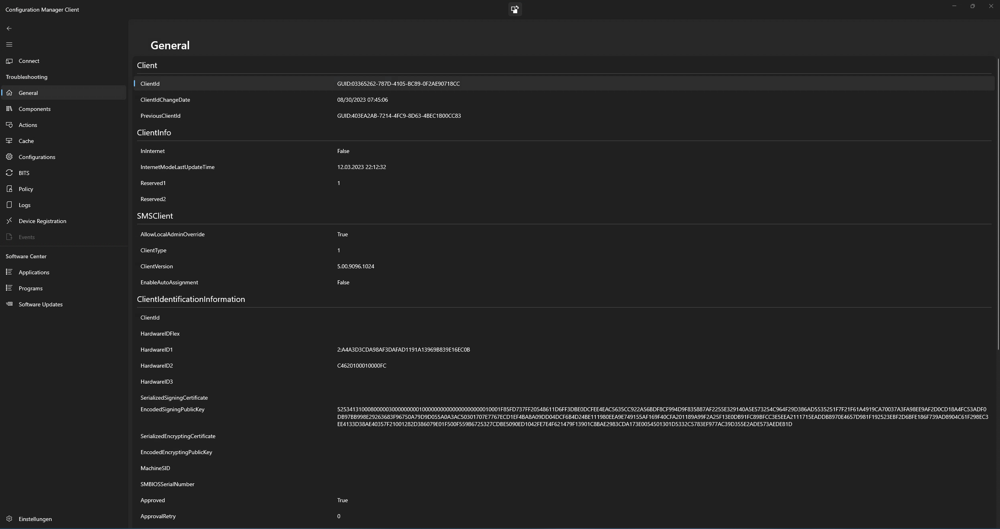

<h3 align="center">Configuration Manager Client</h3>

  Configuration Manager Client is a management client to Troubleshoot Configuration Manager Client problems
   
  <a href="https://github.com/deploymenttoolkit/DeploymentToolkit.ConfigurationManager.ConfigurationClient/issues">Report Bug</a>
  ·
  <a href="https://github.com/deploymenttoolkit/DeploymentToolkit.ConfigurationManager.ConfigurationClient/issues">Request Feature</a>

## Table of Contents

* [About the Project](#about-the-project)
* [Screenshots](#screenshots)
  * [Built With](#built-with)
* [Getting Started](#getting-started)
  * [Prerequisites](#prerequisites)
  * [Installation](#installation)
* [Usage](#usage)
* [Roadmap](#roadmap)
* [Contributing](#contributing)
* [License](#license)
* [Contact](#contact)
* [Acknowledgements](#acknowledgements)

## About The Project

### Screenshots

### Built With

TODO

## Getting Started

To get a local copy up and running follow these simple steps.

### Prerequisites

TODO

### Installation

TODO

## Usage

TODO

## Roadmap

No roadmap at the moment. I will program what is needed and what I'll feel like doing.

## Contributing

Contributions are what make the open source community such an amazing place to be learn, inspire, and create. Any contributions you make are **greatly appreciated**.

1. Fork the Project
2. Create your Feature Branch (`git checkout -b feature/AmazingFeature`)
3. Commit your Changes (`git commit -m 'Add some AmazingFeature'`)
4. Push to the Branch (`git push origin feature/AmazingFeature`)
5. Open a Pull Request

## License

Distributed under the GNU General Public License v3.0 License. See `LICENSE` for more information.

## Contact

Gérald Döserich - [@TheBlueFireKing](https://twitter.com/TheBlueFireKing) - github@doeseri.ch

Project Link: [https://github.com/deploymenttoolkit/DeploymentToolkit.ConfigurationManager.ConfigurationClient](https://github.com/deploymenttoolkit/DeploymentToolkit.ConfigurationManager.ConfigurationClient)

## Acknowledgements
TODO
<!--
* 
* 
* 
-->
